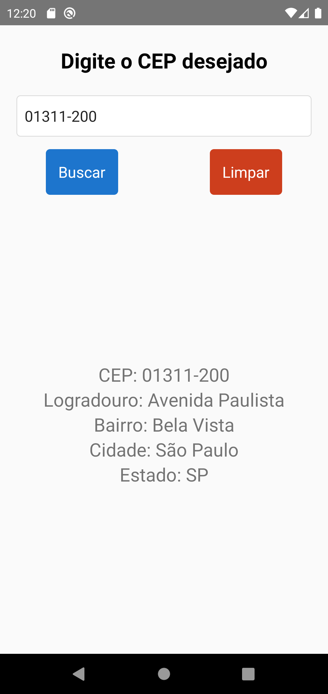

<h1 align="center"> Via Cep </h1>

  

 

  

## 🚀 Tecnologias

Esse projeto foi desenvolvido com as seguintes tecnologias:

- React Native
- JavaScript
- TypeScript
- Git e Github

## 💻 Projeto

O Via Cep é um consultor de CEP.

## :memo: Licença

Esse projeto está sob a licença MIT.

---

Feito com ♥ by Gabriel Cursi
